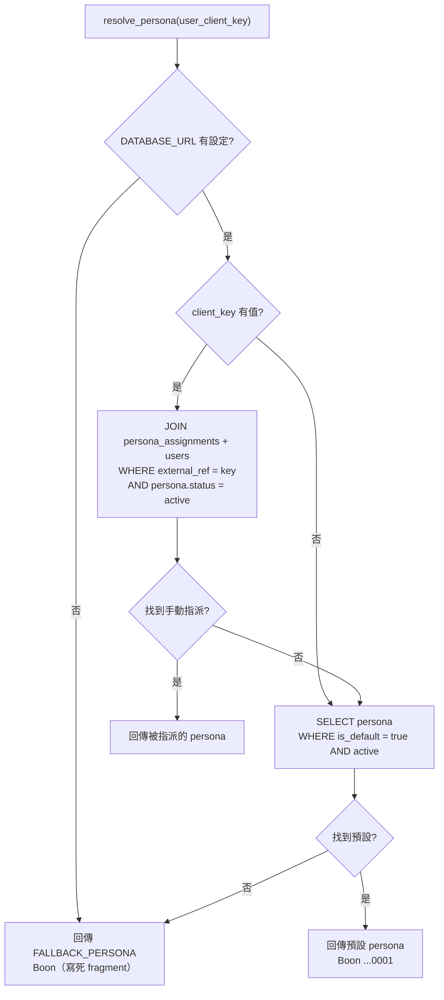
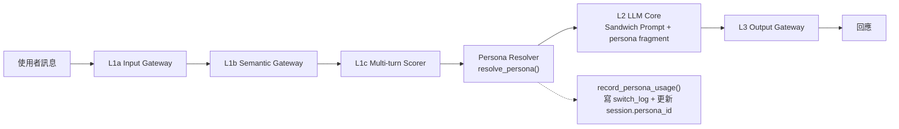
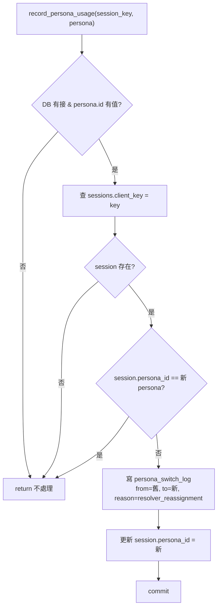

# Phase 1 — Persona 系統架構（Developer 導向）

**專案**：PeaceMind — 心理諮詢 AI 助理「Boon / 阿本」
**版本**：Phase 1（Persona 系統）
**日期**：2026-08-14
**Migration**：`102d7d73bbd7_phase1_persona_system.py`（revises `b6dcae4f4555`）

---

## 1. 目的

Phase 1 把原本寫死在 `system_prompt.py` 的「Boon」人格，抽離成可管理、可指派的 **Persona** 實體：

1. 治療師可建立多個 persona（語氣 / 身份 / 核心原則不同）。
2. 治療師可把某個 persona **手動指派**給特定學生，覆寫系統預設。
3. 指派後，該學生下一次對話語氣「真的換了」，並留下切換記錄。

Phase 1 **只做前兩層解析**（手動指派 → 系統預設）。`persona_match_conditions` 的自動匹配是 Phase 2（等 `user_profiles` / `profile_topics` 建好才啟用）。

---

## 2. 模組對照

| 檔案 | 職責 |
|------|------|
| `app/db/models.py` | Phase 0：`users` / `sessions` / `messages` |
| `app/db/models_persona.py` | Phase 1：`therapists` / `personas` / `persona_match_conditions` / `persona_assignments` / `persona_switch_log` |
| `app/core/persona_resolver.py` | `resolve_persona()` + `record_persona_usage()` |
| `app/prompts/system_prompt.py` | 三明治 Prompt 組裝；`DEFAULT_PERSONA_FRAGMENT` 僅作無 DB fallback |
| `app/routers/admin_personas.py` | Admin API（建立 / 啟用 / 指派） |
| `app/routers/chat.py` | 主對話流程，在 L2 前插入 Resolver |
| `app/storage/postgres_store.py` | 匿名 user 綁定（`users.external_ref` ← `session_id`） |

---

## 3. 資料庫 Schema（ER Diagram）

```mermaid
erDiagram
    therapists ||--o{ personas : "created_by"
    therapists ||--o{ persona_assignments : "assigned_by"
    users ||--o{ sessions : "user_id"
    users ||--o{ persona_assignments : "user_id"
    sessions ||--o{ messages : "session_id"
    sessions }o--o| personas : "persona_id"
    messages }o--o| personas : "persona_id"
    personas ||--o{ persona_match_conditions : "persona_id"
    personas ||--o{ persona_assignments : "persona_id"
    personas ||--o{ persona_switch_log : "from_persona_id"
    personas ||--o{ persona_switch_log : "to_persona_id"
    sessions ||--o{ persona_switch_log : "session_id"

    therapists {
        uuid id PK
        text name
        text email UK
        text role
    }
    personas {
        uuid id PK
        text name
        text tone
        text system_prompt_fragment
        text status
        boolean is_default
        uuid created_by FK
    }
    users {
        uuid id PK
        text external_ref UK
    }
    sessions {
        uuid id PK
        uuid user_id FK
        text client_key UK
        uuid persona_id FK
    }
    messages {
        uuid id PK
        uuid session_id FK
        text role
        text content
        uuid persona_id FK
    }
    persona_assignments {
        uuid user_id PK_FK
        uuid persona_id FK
        uuid assigned_by FK
        text note
    }
    persona_match_conditions {
        uuid id PK
        uuid persona_id FK
        jsonb condition_json
        int priority
    }
    persona_switch_log {
        uuid id PK
        uuid session_id FK
        uuid from_persona_id FK
        uuid to_persona_id FK
        text trigger_reason
    }
```

### 關鍵 FK

| 關係 | 屬性 | 說明 |
|------|------|------|
| `persona_assignments.assigned_by` → `therapists.id` | `NOT NULL` | 指派者必須是合法治療師（見 §6） |
| `persona_assignments.user_id` → `users.id` | PK + CASCADE | 一個 user 只能被指派一個 persona |
| `personas.created_by` → `therapists.id` | nullable | seed 的預設 persona 無建立者 |
| `sessions.persona_id` / `messages.persona_id` | nullable | Phase 1 補正式 FK |

---

## 4. Persona 解析流程



**優先序**：手動指派 > 系統預設（`is_default`） > 程式 fallback。

---

## 5. 對話管線整合



`record_persona_usage()` 邏輯：



---

## 6. 已知問題（實作筆記未記錄）—— ✅ 已修復（2026-08-14）

`persona_assignments.assigned_by` 對 `therapists` 有 **`NOT NULL` FK 約束**，但原本 `therapists` 表完全為空、也沒有任何建立治療師記錄的入口（Admin API 只做 persona 的 CRUD），導致 `POST /personas/assign` 插入 `assigned_by` 時沒有合法 `therapists.id` 可填，會直接噴 FK violation——即使 Admin API 沒做權限驗證，指派功能實際上也打不通。

**修復方式**：新增 migration `cbda7ba4a1c9_seed_placeholder_therapist.py`（revises `102d7d73bbd7`），比照 `DEFAULT_PERSONA_ID` 的做法，種入一筆固定 UUID 的 placeholder therapist：

| 欄位 | 值 |
|------|-----|
| `id` | `00000000-0000-0000-0000-000000000001` |
| `name` | Placeholder Therapist（暫代，Phase 8 前使用） |
| `email` | `placeholder-therapist@peacemind.local` |
| `role` | `admin` |

已在本機 Docker Postgres 與 Supabase 正式環境跑過 `alembic upgrade head` 套用（2026-08-14）。呼叫 `/personas/assign` 時 `assigned_by` 可暫時填這個固定 id，讓指派邏輯在 Phase 8 真實治療師登入機制上線前也能被呼叫、驗證。

**仍待處理**：這只是頂住 FK 的暫時措施，不是真正的權限驗證——Admin API 依然不驗證呼叫端填的 `assigned_by` 是否為本人。Phase 8 導入真實治療師登入後，這筆 placeholder 記錄要決定保留當系統帳號、還是汰換掉。

---

## 7. Admin API 端點

| 方法 | 路徑 | 說明 |
|------|------|------|
| `GET` | `/api/v1/admin/personas` | 列出所有 persona |
| `POST` | `/api/v1/admin/personas` | 建立 persona |
| `PATCH` | `/api/v1/admin/personas/{id}/activate` | 啟用指定 persona |
| `POST` | `/api/v1/admin/personas/assign` | 指派 persona 給 user（`session_id` → `external_ref`） |

---
*文件更新時間：2026-08-14*
