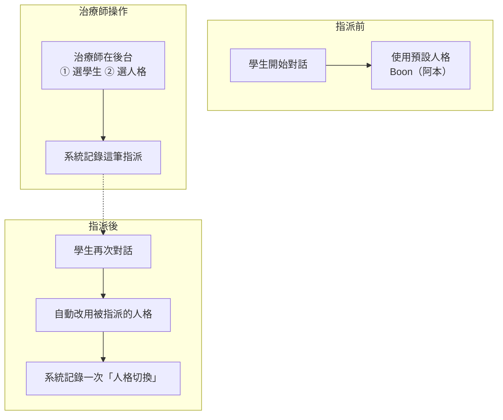

# Phase 1 — Persona 系統總覽（User 導向）

**專案**：PeaceMind — 心理諮詢 AI 助理「Boon / 阿本」
**版本**：Phase 1（Persona 系統）
**日期**：2026-08-14

---

## 1. 什麼是 Persona？

Persona 就是 AI 助手的「**人設**」—— 它用什麼身份、什麼語氣、抱持什麼核心原則跟你對話。

- 系統內建一個預設人格：**Boon（阿本）**，溫暖、同理、以 CBT / ACT 為基礎。
- 治療師可以另外建立不同人格（例如針對青少年、長者、或特定療程風格），再指派給特定的學生。

---

## 2. 系統如何運作（概念圖）

### 用白話講

1. **沒有指派時**：所有學生都用預設的 Boon 對話。
2. **治療師指派**：把某個學生綁定到某個特定人格。
3. **指派生效**：該學生下次開口，AI 就「換了語氣」，而且系統會留一筆「從 Boon 換成某某人格」的記錄，方便日後追蹤。

---

## 3. 指派前後對照

| 情境 | 學生看到的 AI 人格 |
|------|-------------------|
| 指派前 | 預設 Boon（阿本） |
| 治療師指派後 | 被指派的 persona（語氣 / 身份隨設定而變） |

---

## 4. 這對使用者代表什麼

- **學生 / 個案**：不需要做任何設定，人格由治療師在後台決定。
- **治療師**：可以針對不同學生，彈性指定最合適的對話人格；每次切換都有記錄可查。
- **系統**：會自動記住「這個學生現在用哪個人格」，下次對話直接套用。

---
*文件更新時間：2026-08-14*
